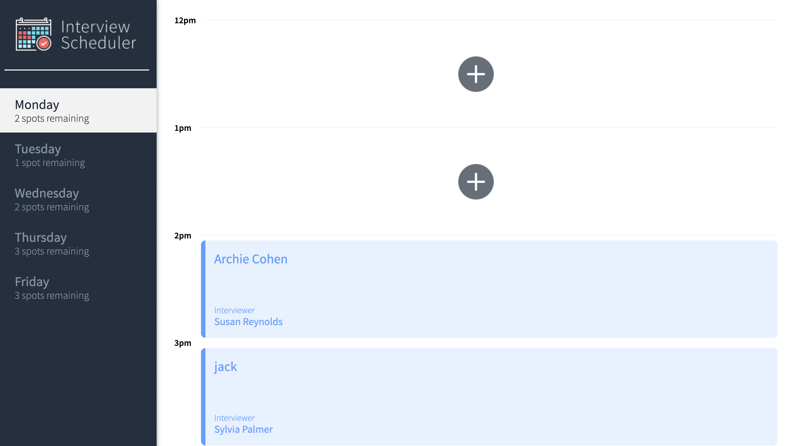
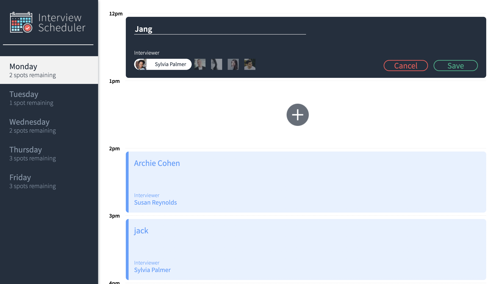
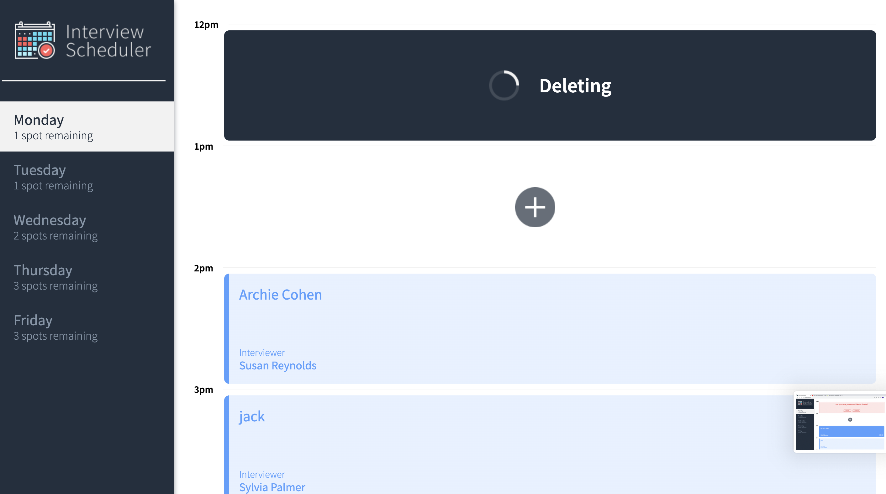
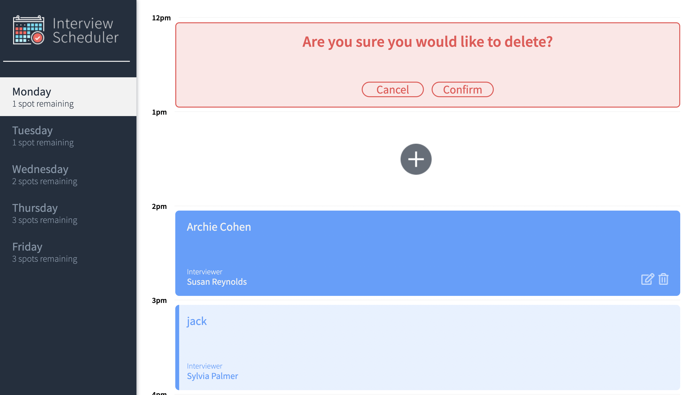

# Interview Scheduler

## Setup

Install dependencies with `npm install`.

## Running Webpack Development Server

```sh
npm start
```

## Running Jest Test Framework

```sh
npm test
```

## Running Storybook Visual Testbed

```sh
npm run storybook
```
## Homepage


## Create Appointment


## Delete Appointment


## Confirm Action

## Dependencies
* react
* react-dom
* react-scripts
* axios
* classnames
* normalize.css